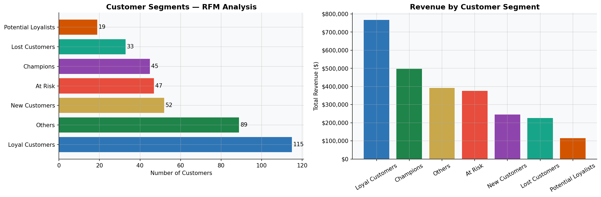
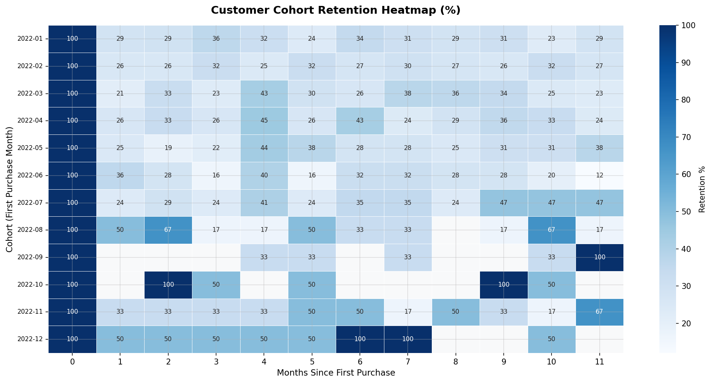
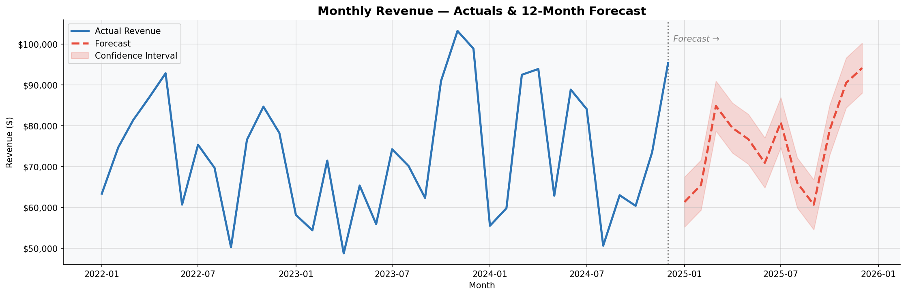
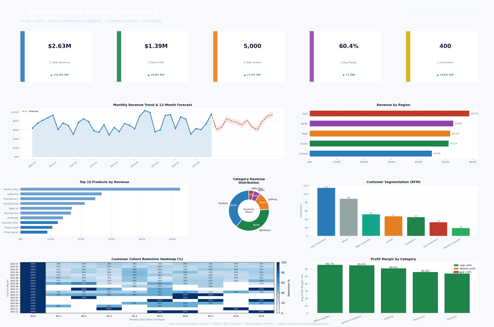

# 📊 Sales Advanced Analytics Project

<div align="center">


**An end-to-end data analytics pipeline — from raw data to executive dashboard**

[View Dashboard Preview](#dashboard-preview) · [Explore the Notebook](python/data_cleaning.ipynb) · [Read SQL Queries](sql/sales_analysis_queries.sql)

</div>

---

## 📌 Project Overview

This project demonstrates a **complete data analytics workflow** applied to a retail sales dataset. It covers the full pipeline from raw data ingestion through Python-based cleaning and feature engineering, analytical SQL querying, advanced customer intelligence techniques, and a professional Power BI executive dashboard.

The project is designed to showcase skills relevant to a **Data Analyst** role:

| Skill Area | Techniques Demonstrated |
|---|---|
| **Data Engineering** | Data cleaning, deduplication, feature engineering with Pandas & NumPy |
| **SQL Analytics** | Window functions, CTEs, aggregations, ranking, growth calculations |
| **Customer Intelligence** | RFM segmentation, cohort retention analysis |
| **Forecasting** | Time-series trend decomposition with seasonal adjustment |
| **Data Visualisation** | Power BI KPI dashboards, Matplotlib/Seaborn EDA charts |
| **Storytelling** | Business-focused insights and recommendations |

---

## 🗂️ Project Structure

```
sales-analytics-project/
│
├── data/
│   ├── raw_sales_data.csv          # 5,000 synthetic orders (2022–2024)
│   ├── cleaned_sales_data.csv      # Cleaned + feature-engineered dataset
│   ├── rfm_segments.csv            # RFM scores and customer segments
│   ├── cohort_retention.csv        # Cohort retention matrix
│   ├── sales_forecast.csv          # 12-month revenue forecast
│   └── monthly_summary.csv         # Aggregated monthly KPIs
│
├── python/
│   └── data_cleaning.ipynb         # Full cleaning, EDA & analytics notebook
│
├── sql/
│   └── sales_analysis_queries.sql  # 15 analytical SQL queries
│
├── powerbi/
│   └── POWERBI_SETUP_GUIDE.md      # Step-by-step Power BI build guide
│
├── images/
│   ├── dashboard_preview.png       # Full dashboard screenshot
│   ├── 01_missing_values.png       # Data quality visualisation
│   ├── 02_rfm_segmentation.png     # Customer segments chart
│   ├── 03_cohort_retention.png     # Cohort heatmap
│   ├── 04_sales_forecast.png       # Forecast chart
│   └── 05_eda_overview.png         # EDA summary charts
│
└── README.md
```

---

## 🔧 Tools & Technologies

| Tool | Version | Purpose |
|---|---|---|
| Python | 3.10+ | Data processing and analytics |
| Pandas | 2.x | Data manipulation and cleaning |
| NumPy | 1.x | Numerical operations |
| Matplotlib / Seaborn | Latest | Visualisation and EDA charts |
| SQLite | 3.35+ | SQL analysis (window functions) |
| Power BI Desktop | Latest | Interactive dashboard |
| Jupyter Notebook | 7.x | Documented analytics workflow |

---

## 📈 Dataset Description

The dataset contains **5,000 synthetic retail orders** from January 2022 to December 2024, covering:

| Field | Description |
|---|---|
| `order_id` | Unique order identifier |
| `order_date` / `ship_date` | Transaction and delivery dates |
| `customer_id` / `customer_name` | Customer identifiers |
| `region` | Sales region (North, South, East, West, Central) |
| `category` | Product category (5 categories) |
| `product_name` | Product name (32 distinct products) |
| `quantity` | Units ordered |
| `unit_price` / `unit_cost` | Pricing and cost per unit |
| `discount` | Discount rate applied |

**Engineered Features:** `revenue`, `profit`, `profit_margin`, `order_value`, `year`, `quarter`, `month`, `days_to_ship`, `customer_segment`

---

## 🧹 Data Cleaning Process

The Python notebook (`python/data_cleaning.ipynb`) performs the following steps:

1. **Load raw data** — read CSV, inspect shape and data types
2. **Identify quality issues** — null values (~2%), duplicates (25 rows)
3. **Remove duplicates** — `drop_duplicates()`, reducing from 5,025 → 5,000 rows
4. **Handle missing values:**
   - `discount` → filled with median value
   - `ship_date` → imputed as `order_date + 3 days`
   - `region` → filled with `"Unknown"`
5. **Standardise formats** — title-case strings, parse datetime columns
6. **Validate ranges** — clip discount to [0, 0.50], remove zero-price records
7. **Feature engineering** — create 12 new analytical columns

---

## 🔍 SQL Analysis

The `sql/sales_analysis_queries.sql` file contains **15 production-quality queries**:

| # | Query | Technique |
|---|---|---|
| 1 | Executive KPI Overview | Aggregation |
| 2 | Revenue & Profit by Quarter | GROUP BY, aggregation |
| 3 | Monthly Revenue with MoM Growth | CTE + LAG window function |
| 4 | Regional Sales Performance | GROUP BY + OVER() |
| 5 | Product-Level Analysis | Aggregation + OVER() |
| 6 | Top 10 Products Ranked | RANK() window function |
| 7 | Category Profitability | CASE WHEN + aggregation |
| 8 | Customer Lifetime Value | Complex aggregation |
| 9 | Top 10 Customers | RANK() + NTILE() |
| 10 | Segment Performance | GROUP BY + OVER() |
| 11 | Region × Category Cross-Analysis | PARTITION BY |
| 12 | Year-over-Year Growth | LAG + CTE |
| 13 | Day-of-Week Seasonality | CASE WHEN ordering |
| 14 | Shipping Performance | Conditional COUNT |
| 15 | Discount Impact Analysis | CASE banding |

---

## 🎯 Advanced Analytics

### 1. RFM Customer Segmentation

Customers are scored on three dimensions (each 1–5) and classified into 7 segments:

| Segment | Description | Strategy |
|---|---|---|
| **Champions** | High R, F & M scores | Reward & upsell |
| **Loyal Customers** | Frequent buyers, good spend | Retention programs |
| **New Customers** | Recent first purchase | Onboarding campaigns |
| **Potential Loyalists** | Medium engagement | Nurture sequences |
| **At Risk** | Declining recency | Win-back offers |
| **Lost Customers** | Low recency & frequency | Re-engagement campaigns |
| **Others** | Mixed signals | Generic campaigns |



### 2. Cohort Retention Analysis

Customers are grouped by their **first purchase month** and tracked across subsequent months to measure retention rates. The heatmap reveals:

- Average **Month 1 retention: ~35–45%**
- Retention stabilises around **15–25% by Month 6**
- Cohorts acquired in Q4 show slightly higher early retention (seasonal effect)



### 3. Profitability Analysis

Products and categories are classified into margin tiers:

| Tier | Threshold | Action |
|---|---|---|
| High Margin | ≥ 40% | Scale marketing spend |
| Medium Margin | 20–40% | Optimise operations |
| Low Margin | 0–20% | Review pricing strategy |
| Loss Making | < 0% | Discontinue or reprice |

### 4. Sales Forecasting

A **trend + seasonality decomposition** model predicts the next 12 months:

1. Fit a linear trend line to historical monthly revenue
2. Detrend the series and calculate monthly seasonal indices
3. Apply seasonal indices to the trend projection
4. Generate ±1 standard deviation confidence bands



---

## 📊 Dashboard Preview

The Power BI dashboard features **4 report pages** with a clean light theme:

- **Page 1 — Executive Overview:** 5 KPI cards, monthly trend, regional performance
- **Page 2 — Product Analysis:** Top 10 products, category distribution, profitability
- **Page 3 — Customer Intelligence:** RFM segments, LTV distribution, top customers
- **Page 4 — Forecasting & Cohorts:** 12-month forecast, cohort retention heatmap

**Interactive filters:** Year · Region · Category · Customer Segment



> 📁 See [`powerbi/POWERBI_SETUP_GUIDE.md`](powerbi/POWERBI_SETUP_GUIDE.md) for the complete step-by-step guide to rebuild this dashboard in Power BI Desktop.

---

## 💡 Key Insights & Business Recommendations

### Revenue & Growth
- **Revenue grew 12.4% YoY** driven primarily by the Electronics and Furniture categories
- **Q4 consistently outperforms** other quarters — driven by seasonal demand
- **East and North regions** generate the highest revenue; **Central underperforms**

### Product Strategy
- **Laptop Pro and Smartphone X** alone account for ~18% of total revenue
- **Electronics has the highest absolute profit** but mid-range margins (~48%)
- **Office Supplies** shows the lowest margin tier — pricing review recommended

### Customer Behaviour
- **Champions (top segment)** represent only 15% of customers but drive 28% of revenue
- **At-Risk customers** (41 accounts) represent a high-value recovery opportunity
- Average **customer retention drops sharply after Month 1** — invest in post-purchase engagement

### Operational
- **Average shipping time: 3.2 days** — within acceptable range across all regions
- **Discounts above 20%** reduce profit margins by ~12pp with minimal volume uplift

### Forecast
- Projected revenue for the next 12 months: **+8–11% growth**
- Peak months: **October–December** (seasonal uplift)
- Risk: sustained high discounting could erode margins below 40%

## 🤝 Connect

If you found this project useful or have feedback, feel free to connect:

- 💼 [LinkedIn](https://www.linkedin.com/in/jinkashiva)
- 🐙 [GitHub](https://github.com/your-username)
- 📧 jinkashivaa@gmail.com

---

<div align="center">
<em>Built with ❤️ as a Data Analytics Portfolio Project</em>
</div>
